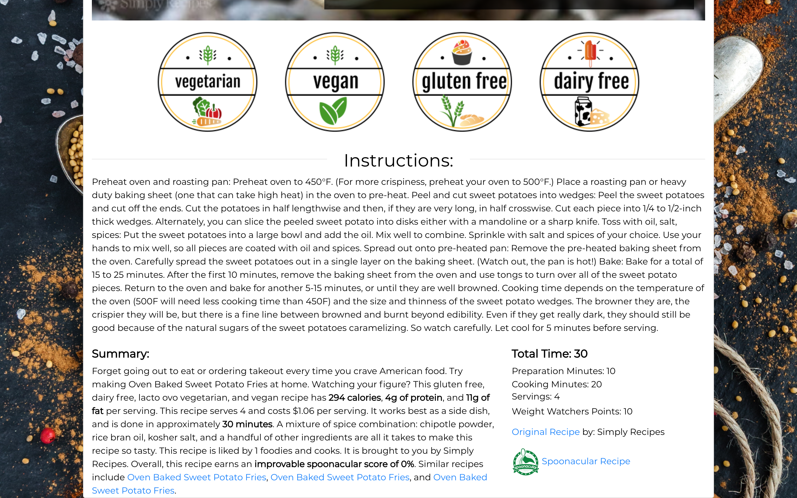

# Recipe Finder

Tired of cooking the same stuff all time? Have a ton of random cans and no idea what to make with them? On a budget and trying to use the whole pantry for dinner instead of picking up something? Recipe Finder is made with you in mind!

Recipe Finder allows you to use the ingredients you have on hand to search for recipes that use those ingredients. It's a great way to save money, learn some new recipes, and expand your cooking repertoire. 

Recipe Finder is a single page web application built with React, Redux, Javascript on the frontend and Ruby on Rails on the backend. Utlizing the Spoonacular API, it makes fetch calls for recipes which include the ingredients, and then renders selected recipes for the user to favorite and come back to time and again.

Available features:

- **Users can sign up to create a new acount, or login to an existing account.**
- **Users can view their favorited recipes on their profile page once logged in.**
- **Users can select from 1000 common ingredients to find recipes that use all or some of the selected ingredients.**
    - **Once an ingredient is selected, the button for that ingredient becomes disabled to prevent users from accidentally double clicking the same ingredient. The ingredient is then listed inside the "Current Selection" box.**
    - **Should a user not want to search for an ingredient in their "Current Selection" box, they can click on the ingredient in the box which removes it from the box and makes the ingredient button not disabled anymore.**
- **Recipes fetched from the API are displayed after a user selects to search; users can quickly see which ingreidents the recipe uses, and which ingredients are needed for each recipe rendered from the API.**
- **Users can click on the recipe to view a more detail recipe card, which includes: **
    - ** picture of recipe **
    - ** button to favorite the recipe and see on user profile **
    - ** dietary information (vegan, vegetarian, gluten free, dairy free)**
    - ** instructions**
    - ** summary provided from API**
    - ** link to original recipe**
    - ** link to recipe on API**

## Installation

- Fork and clone this repo and [the backend repo](https://github.com/adybas/capstone-backend)

- First, make sure that Postgres is running on your computer. Then cd into the capstone-backend directory and run these commands:
  - Run `$ rails db:create`
  - Run `$ rails db:migrate`
  - Run `$ rails s`
  
- After the backend is up, open the capsteon-frontend directory and run these commands:
  - Run `$ npm install`
  - Run `$ npm start`

## Screenshots of Website

#### Home
 

#### Sign In

#### Sign Up
 

#### User Profile
 

#### Ingredient Selection
 

#### Ingredient Search
 

#### Ingredient Button Disabled after Selection
 

#### Recipes from Selected Ingredients
 

#### Recipe Detail Page - Pic and Favorite Button
 

#### Recipe Detail Page - Dietary Info, Instructions and More Info
 

#### Favorite Recipe Button Change
 

## Frameworks and Libraries Used

- Front-end: JavaScript, [React](https://reactjs.org/), and [Redux](https://redux.js.org/)
- Back-end: [Ruby on Rails](https://github.com/rails/rails)
- UI:[Bootstrap](https://getbootstrap.com/), [React Bootstrap](https://react-bootstrap.github.io/), and custom CSS
    - Dietary Icons on Recipe Detail Page are custom made from [freelogodesign.org](https://www.freelogodesign.org)

## Author

- Anna Dybas (https://github.com/adybas)

## Contributing

Bug reports and pull requests are welcome on GitHub at https://github.com/adybas/capstone-frontend/issues. This project is intended to be a safe, welcoming space for collaboration, and contributors are expected to adhere to the [Contributor Covenant](http://contributor-covenant.org) code of conduct.

## License

